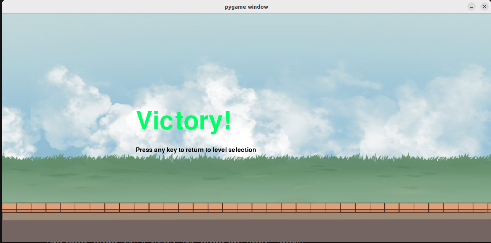

# oop-2025-proj-TBC  蝸牛大冒險

本專案為 OOP-2025 課程專案。以下是專案的目錄結構概覽以及主要檔案和資料夾的用途說明。

## 專案結構
oop-2025-proj-TBC/

├── main.py              # 應用程式入口點，初始化並啟動遊戲

├── game/

│   ├── init.py      # 標記為 Python 套件，控制模組導入

│   ├── game_loop.py     # 管理遊戲事件循環、狀態更新和渲染

│   ├── constants.py     # 儲存遊戲常數（如螢幕尺寸、速度、顏色）

│   ├── config_loader.py # 讀取並解析遊戲配置文件（如 JSON）

│   ├── battle_logic.py  # 處理戰鬥邏輯和規則

│   ├── ui.py            # 負責繪製使用者介面（如選單、生命條）

│   └── entities/

│       ├── init.py  # 標記為子套件

│       ├── cat.py       # 定義 Cat 類別及其行為

│       ├── cat_data.py  # 儲存貓咪類型和屬性數據

│       ├── enemy.py     # 定義 Enemy 類別及其行為

│       ├── enemy_data.py # 管理敵人屬性數據

│       ├── level.py     # 定義關卡結構

│       ├── level_data.py # 儲存關卡數據（如敵人波次）

│       ├── tower.py     # 定義 Tower 實體

│       ├── smokeeffect.py # 實現煙霧效果

│       ├── shockwaveeffect.py # 實現衝擊波效果

│       └── soul.py      # 定義 Soul 實體（資源或敵人）

│   ├── cat_folder/

│   │   └── XX/

│   │       ├── walking/ # 走路動畫

│   │       ├── attacking/ # 攻擊動畫

│   │       └── config.py # 角色資料

│   ├── enemy_folder/

│   │   └── XX/

│   │       ├── walking/ # 走路動畫

│   │       ├── attacking/ # 攻擊動畫

│   │       └── config.py # 敵人資料

│   ├── level_folder/

│   │   └── level_X/

│   │       └── config.py # 關卡資料

│   └── background/

│       └── background1.png # 背景圖片

└── background/

└── backgroundStory.txt # 開場動畫故事內容

## 功能特性
- **開場動畫**：從下往上滑動的故事介紹，可點擊 "Skip" 跳過。
- **關卡選擇**：選擇可玩關卡並組建貓咪隊伍（最多 10 隻）。
- **戰鬥系統**：實時部署貓咪，管理預算和冷卻時間，與敵人戰鬥。
- **暫停與結束**：提供暫停選單和遊戲結束畫面。
- **進度保存**：通關關卡後保存到 `completed_levels.json`。
- **視覺效果**：包含煙霧、衝擊波和靈魂收集（未來功能）。

## 玩法:
- **開場**
執行main.py後, 會出現開場畫面, 你可以點擊skip, 或是看完整個~~很唬爛的~~介紹

- **菜單**
到了菜單, 關卡會先鎖住level 2以後的關卡, 確保你有能力通過比較前面簡單的關卡 ~~（可能後面比較簡單, 反正原版遊戲有這個案例）~~, 通過level 1可以玩level 2, 以此類推
另外, 點選可以出擊的角色, 亮綠燈代表你已經帶上, 灰色的話代表你還沒帶, 至多10隻 ~~實際上只有五隻角色~~

- **戰鬥**
到了battle畫面, 點選鍵盤上的1出擊basic, 2出擊speedy, 以此類推, 另外可以按暫停鍵暫停遊戲

- **輸贏**
若敵方塔血=0時, 代表我方勝利
反之, 就是敵方勝利


## 需求與安裝
### 必要依賴
- Python 3.8 或更高版本
- Pygame 2.0 或更高版本

### 安裝步驟
1. 克隆專案到本地：
   ```bash
   git clone https://github.com/yourusername/oop-2025-proj-TBC.git
   cd oop-2025-proj-TBC
2. 設定虛擬環境（如果有意保持整潔）
    ```bash
    python -m venv venv
    source venv/bin/activate  # Linux/Mac
    venv\Scripts\activate     # Windows
3. 安裝pygame
    ```bash
    pip install pygame
4. 執行main.py
    ```bash
    python3 main.py
